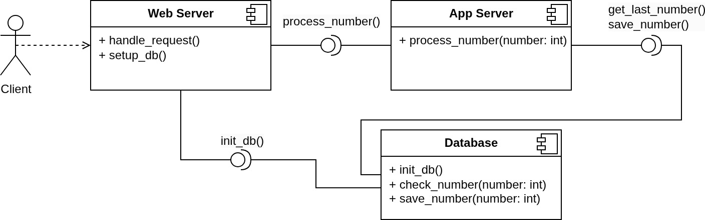

# Вторая ачивка 🚀
## Задание:
Необходимо спроектировать и описать на языке UML классическую линейную 3-х уровневую архитектуру: [КЛИЕНТ]<->ВЕБ-СЕРВЕР<->СЕРВЕР ПРИЛОЖЕНИЙ<->БАЗА ДАННЫХ
Задача, которую должна выполнять система:
1. Обрабатывать HTTP POST запрос, в котором натуральное число от 0 до N, в ответ на запрос отправлять число, увеличенное на единицу.
2. Обрабатывать исключительную ситуацию #1: если число уже поступало, то выводить ошибку в ответ и лог.
3. Обрабатывать исключительную ситуацию #2: если поступивщее число на единицу меньше уже обработанного числа, то выводить ошибку в лог.

### Стандартная сложность
Разработать диаграмму компонентов для систему на языке UML (Component diagram).

### Средняя сложность
Выполнить задание стандартной сложности. Разработать диаграмму последовательностей для системы на язке UML (Sequence diagram)

### Высокая сложность
Выполнить задание средней сложности. Разработать систему на одном из языков программирования PYTHON/PHP/JS.

## Стандартная сложность
### Диаграмма компонентов


## Средняя сложность
### Диаграмма последовательностей


## Высокая сложность
1. Склонируйте репозиторий
```bash
git clone https://github.com/Kio131/2-achievement.git
cd 2-achievement
```
2. Соберите и запустите docker-контейнер
```bash
cd Code
docker compose up --build
```
3. Провьте работоспособность приложения с помощью curl-запроса
```bash
curl -X POST http://127.0.0.1:5000/rvs_web_app \             
  -H "Content-Type: application/json" \
  -d '{"number": 5}'
   Ответ должен быть следующим
```
   Ответ должен быть следующим
```bash
{"result":6,"status":"success"}
```
   При повторной попытке вызова команды ответ будет слебующим
```bash
{"Description":"The 'number' parametr has already been processed","status":"ERROR1"}

```
